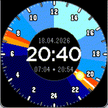
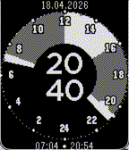

# Sunset

### A Solar Dial inspired watchface for Pebble

*Track the sun across a 24-hour dial — daylight, twilight, and night at a glance.*

---

<table align="center">
  <tr>
    <td align="center" valign="middle">
       
      <b>Gabbro</b>
    </td>
    <td align="center" valign="middle">
       
      <b>Emery</b>
    </td>
    <td align="center" valign="middle">
       
      <b>Basalt</b>
    </td>
    <td align="center" valign="middle">
       
      <b>Chalk</b>
    </td>
    <td align="center" valign="middle">
       
      <b>Flint</b>
    </td>
  </tr>
</table>

---

## About

Built motivated by the [Spring 2026 Pebble App Contest](https://repebble.com/blog/spring-2026-pebble-app-contest) as a proof of concept. Sunset is inspired by the [Solar Dial watchface on Apple Watch](https://support.apple.com/guide/watch/faces-and-features-apde9218b440/watchos#apd348fe40c5) and maps a full day onto a single 24-hour analog face — so you can *see* where you are in the day relative to sunrise and sunset.

> I had no prior Pebble experience, so I used the official Pebble Claude Skill to scaffold the project. It's written in C; a modern JavaScript (ALLOY) rewrite would probably be preferable.

## Features

- **24-hour dial** with a sun/moon indicator that orbits the face throughout the day
- **Colored arcs** distinguish daylight, twilight, and night at a glance
- **Sunrise & sunset times** fetched from [open-meteo.com](https://api.open-meteo.com) — via location services or manual lat/lon
- **Digital time** in 24h format, centered on the face
- **Date** above the digital time
- **Sunrise & sunset times** displayed below the digital time
- Runs on **Gabbro, Emery, Basalt, Chalk, and Flint**

## Install

Grab it from the [Pebble App Store](https://apps.repebble.com/42cab49dbb4d4b26bb981ecb).

## Roadmap

Pull requests are very welcome.

- [ ] Keep the digital time display from drifting outside the center circle
- [ ] Compute sunrise/sunset locally instead of relying on open-meteo
- [ ] App icon and store wallpaper
