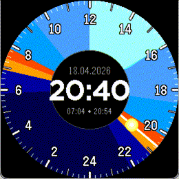
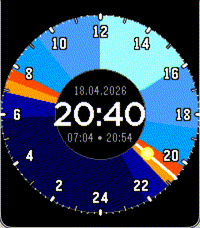
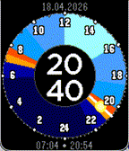

# Sunset - A Solar Dial inspired Watchface for Pebble.

<table align="center">
  <tr>
    <td align="center" valign="middle">
       
      <b>Gabbro</b>
    </td>
    <td align="center" valign="middle">
       
      <b>Emery</b>
    </td>
    <td align="center" valign="middle">
       
      <b>Basalt</b>
    </td>
  </tr>
</table>

Install via the [Pebble App Store](https://apps.repebble.com/42cab49dbb4d4b26bb981ecb).

As part of the [Spring 2026 Pebble App Contest](https://repebble.com/blog/spring-2026-pebble-app-contest), I built this watchface as a proof of concept. It displays the current sunset and sunrise times, and the current time in a style similar to the [Solar Dial watchface designed by Apple](https://support.apple.com/guide/watch/faces-and-features-apde9218b440/watchos#apd348fe40c5).

Since I did not have experience with Pebble development, I used the Claude Skill provided by Pebble to generate the basis of this app. The app is written in C, though I reccon using JavaScript would be the more modern approach.

## Features

- Displays the current sunset and sunrise times either via location services or via user input of latitude and longitude. I used the https://api.open-meteo.com API to get the sunset and sunrise times.
- Displays a 24-hour clock face with a sun/moon that moves around the clock face based on the current time.
- Colored arcs represent the daylight, twilight, and nighttime periods.
- The time is additionally displayed in 24h format in the center of the watchface.
- The date is displayed above the digital time display.
- The sunrise and sunset times are displayed under the digital time display.

## Open Issues

Pull requests are welcome. Here are some of the open issues:
- [] The digital time display sometimes goes out of the center circle.
- [] I'd like to add a calculation to determine sunrise and sunset without using the open-meteo API.
- [] Icons, and a store wallpaper would be nice.